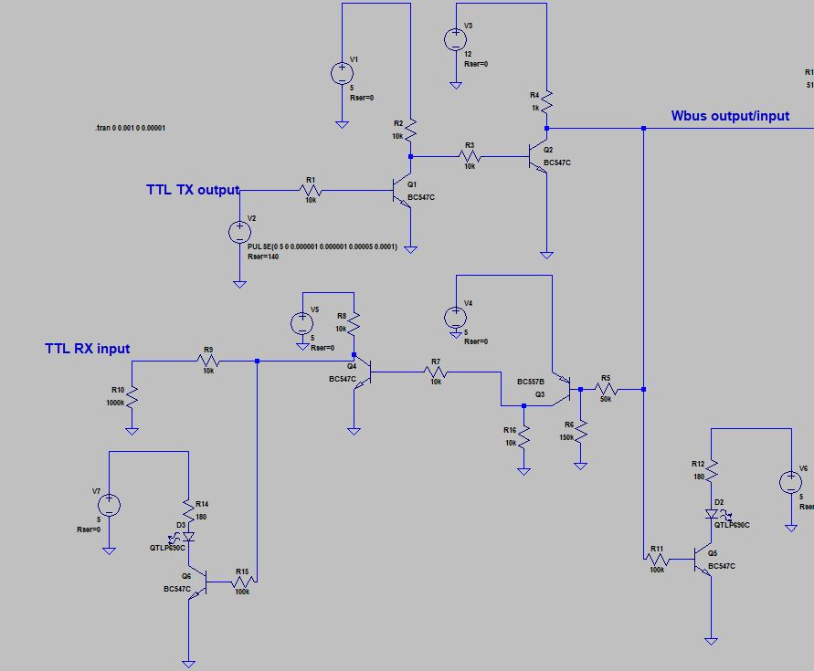
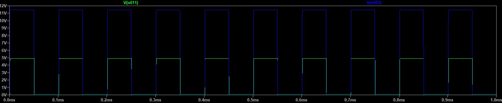
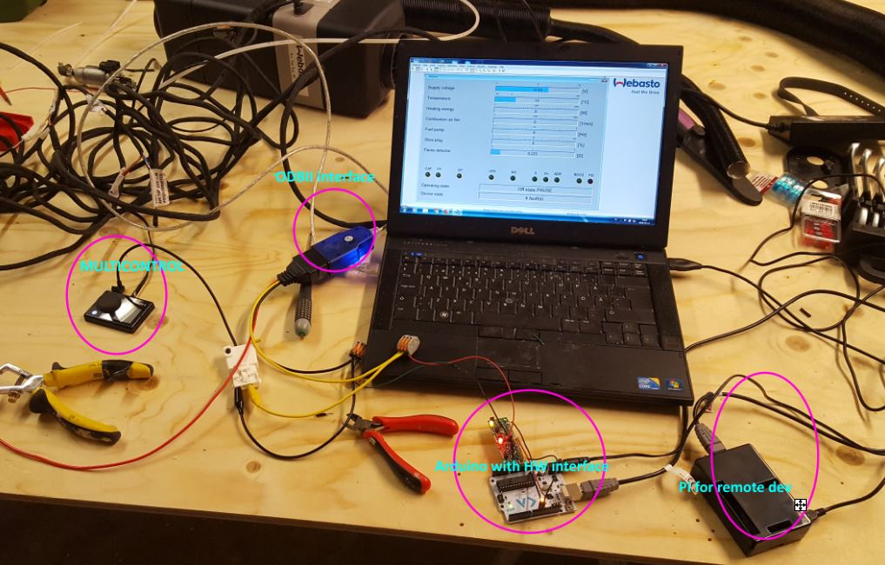

# Interfacing a webasto heater using K-line interface
Mostly because my webasto air top evo 40 broke down and I was told to send the unit back to repair shop for SW reset in order to get it working again. I decided to put some effort into understanding and hopefully be able to controll the heater without sending things back to repair shop in the future.

The goal of this project is the following:

1) Implement HW interface that can talk to the webasto implemented W-bus (K-line) using arduino HW and simple HW TTL/K-line interface.
2) Implement SW that can sniff the webasto traffic
3) Implement SW that can talk to the webasto
4) Map protocol used to communicate with my webasto air top evo 40. May be scalable to other versions?? Already present in libwbus project. See below
5) Build diagnostic box with status LCD display that monitors the Webasto heater.

The arduino UNO was selected together with a raspberry pi (for remote development) was selected in this project.

Dependencies
-------------
*) Arduino framework

*) Arduino Makefile (Do not need IDE) https://github.com/sudar/Arduino-Makefile

*) CustomSoftwareSerial (serial replacement) (https://github.com/ledongthuc/CustomSoftwareSerial)

*) newLiquidCrystal (https://bitbucket.org/fmalpartida/new-liquidcrystal/wiki/Home)

*) LibWbus (uses documentation only + code review)  https://sourceforge.net/projects/libwbus/

W-bus protocol
-------------

The W-bus protocol is a bi-directional link using single physical line for communication. On the physical layer it uses 0 -> 12V signaling. The w-bus is a K-line interface. The K-line interface is described in ISO 9141. Normally the K-line is interfaced using integrated chips. In this project the TTL to K-line is solved using simple NPN PNP transistors.

On the physical layer the communication is a serial line with 2400 baud 8E1 format (NOTE: Arduino SoftwareSerial does not support parity check!!, use CustomSoftwareSerial or something similar that support parity). The protocol is packet based with the following structure

 Header-length-command-data-checksum.

More information on the protocol can be found in the repo in text file: webasto_wbus.txt (stolen from libwbus repo)

HW interface
------------
THe HW interface is simulated using LTspice from linear tech, which is an excellent freeware implmentation of SPICE. The HW interface is a TTL to W-bus (K-line) converter using standard resistors and NPN transistors.

Dependent on the ODB circuit used and the webasto K-line interface the input/output resistances may need to be scaled.
The above circuit was simulated. The resulting curves with TX TTL baudrate 9600 shown at the W-bus output (12V) and the resulting curve at the RX TTL interface (+5v).

Webasto <-> PC arduino sniffer
----------------------
Using arduino and together with a the RX parts of the above HW interface a sniffer was built and connected just to listen to the traffic between the Webasto air top evo 40 and the WTT software. The PC is connected viw ODB II inteface (RS232 + LM339 comp + misc passive) to the K-line at the smartcontrol/multicontrol of the webasto heater.
Picture below shows the setup.

Below is the first packets sniffed from arduino side:

  F43ACA6F5 
  F41F5060A365020A030615C1C7B42CD062871F244E4AA68C599133CD9E52575FF04AFF 
  
Interpreted using libwbus documentation:

Line 1: Header = 0xF4, Length = 0x03 bytes, Command = 0xAC, Data = A6, Checksum = 0xF5

testing checksum (https://www.scadacore.com/tools/programming-calculators/online-checksum-calculator/)

The problem with the above was that the checksum did not fit XOR as from the documentation for LIBWBUS. After some reading it was discovered that the communication is on the physical layer serial-8E1 and the SoftwareSerial library does not support parity check. After replacing the SoftwareSerial with CustomSoftwareSerial that supports parity the following was sniffed:

F4 3 56 1 A0  
F4 1F 50 30 1 3 5 6 7 8 A C E F 10 11 13 1E 1F 24 27 29 2A 2C 2D 32 34 3D 52 57 5F 78 89  

Using XOR parity the last byt checks out. According to the libwbus documentation the two commands above are 56 and 50. It was noted in this phase that the RX response was missing. This was fixed using a modified HW interface. HW schematic above is updated. Needed PNP switch instead of NPN switch on RX input.

After this fix the following was sniffed

TX-cmd:F4 03 56 01 A0  RX-response:4F 10 D6 01 04 02 01 07 07 01 00 A3 01 00 97 01 01 BB

This concludes that the sniffer part now works. The webasto sniffer is copied to the webasto_sniffer repo. Just to keep this strand alone

